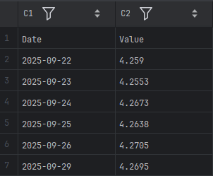
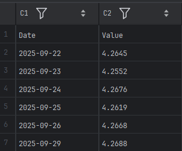
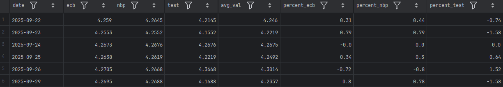
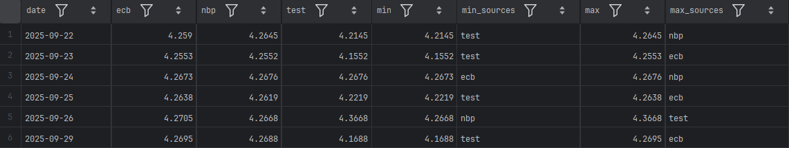

# Currency Tracker with Linux

Currency Tracker is a Python project for fetching historical and current exchange rates from multiple sources (NBP and ECB), processing the data, and saving it in CSV or XML formats. It also allows calculating differences, min/max values, and percentage deviations between sources.
## Features
- Download exchange rates from NBP and ECB APIs
- Load and save data in CSV and XML formats
- Calculate differences between sources, min/max values, and percentage deviations
- Handle multiple sources simultaneously


# Example Commands

Fetching data:
```bash
# Download data from ECB
python3 src/fetch.py --from_date 2025-09-20 --source ECB --out_format CSV --path data/ecb.csv

# Download data from NBP
python3 src/fetch.py --from_date 2025-09-20 --source NBP --out_format CSV --path data/nbp.csv
```
| NBP Data | ECB Data |
|----------|----------|
|  |  |

Calculations:
```bash 
# Calculate percentage differences relative to the max value
python3 src/calc.py --data_folder data --operation 1 --path calculations/perc.csv --out_format CSV

# Calculate min and max values across sources
python3 src/calc.py --data_folder data --operation 2 --path calculations/minmax.csv --out_format CSV
````
| Min-max                              | Percentage                           |
|--------------------------------------|--------------------------------------|
|  |  |

## Quick Start
1. Fetch exchange rates for your desired date range:
```bash
python3 src/fetch.py --from_date 2025-09-07 --source NBP --out_format CSV --path data/nbp.csv
python3 src/fetch.py --from_date 2025-09-07 --source ECB --out_format CSV --path data/ecb.csv
```
2. Compute differences or statistics:
```bash
python3 src/calc.py --data_folder data --operation 1 --path calculations/perc.csv --out_format CSV
python3 src/calc.py --data_folder data --operation 2 --path calculations/minmax.csv --out_format CSV
```

## Requirements
- Python 3.12+
- requests
